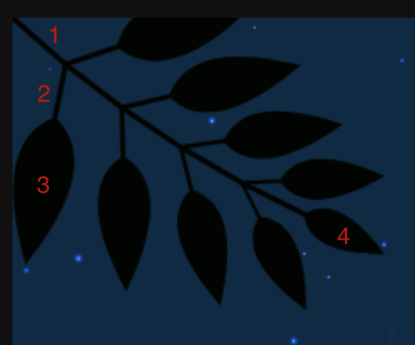

##canvas story
####用canvas讲一个故事
在codepen上看到了一个烟花燃放的特效，觉得很有故事性，除了canvas
的3d外，觉得拿canvas讲一个故事也是不错的。

 [源码地址](http://codepen.io/K-T/pen/NjyNQy)
 
###效果图

See the Pen <a href="https://codepen.io/shadowwalkerzero/pen/wemXqp/">fireworks seen in the countryside</a> by shadowwalkerzero (<a href="https://codepen.io/shadowwalkerzero">@shadowwalkerzero</a>) on <a href="https://codepen.io">CodePen</a>.

###源码结构
入口: RENDERER.init

步骤:
 
1. this.setParameters();         //设置canvas  叶子掉落间隔

2. this.reconstructMethod();	      //在render中绑定this
 
3. this.createTwigs();            //绘叶子

4. this.createStars();				//绘星星

5. this.render();					//绘画

### createTwigs 绘叶子

源码实例:

 		this.twigs.push(new TWIG(this.width, this.height, 0, 0, Math.PI * 3 / 4, 0));
        this.twigs.push(new TWIG(this.width, this.height, this.width, 0, -Math.PI * 3 / 4, Math.PI));
        this.twigs.push(new TWIG(this.width, this.height, 0, this.height, Math.PI / 4, Math.PI));
        this.twigs.push(new TWIG(this.width, this.height, this.width, this.height, -Math.PI / 4, 0));

#### 关于Twig的实现
	var TWIG = function(width, height, x, y, angle, theta){
	    this.width = width;
	    this.height = height;
	    this.x = x;
	    this.y = y;
	    this.angle = angle;
	    this.theta = theta;
	    this.rate = Math.min(width, height) / 500;
	};
	
TWIG 的构造函数 

width: canvas 的width

height: canvas 的height

x: 绘画的 x 起点

y: 绘画的 y 起点

angle: canvas的旋转的角度

theta: 细枝的初始值
	
	TWIG.prototype = {
    SHAKE_FREQUENCY: Math.PI / 300,
    MAX_LEVEL: 4,
    COLOR: 'hsl(120, 60%, 1%)',

    renderBlock : function(context, x, y, length, level, angle){
        context.save();
        context.translate(x, y);
		 context.rotate(this.angle + angle * (level + 1));
        context.scale(this.rate, this.rate);
        context.beginPath();
        context.moveTo(0, 0);
        context.lineTo(0, -length);
        context.stroke();
        context.fill();

        if(level == this.MAX_LEVEL){
            length = length / (1 - level / 10);

            context.save();
            context.beginPath();
            context.scale(1 - level / 10, 1 - level / 10);
            context.moveTo(0, -length);
            context.quadraticCurveTo(30, -length - 20, 0, -length - 80);
            context.quadraticCurveTo(-30, -length - 20, 0, -length);
            context.stroke();
            context.fill();
            context.restore();
            context.restore();
        }else{
            for(var i = -1; i <= 1; i += 2){
                context.save();
                context.translate(0, -40);
                context.rotate((Math.PI / 3 - Math.PI / 20 * level) * i);
                context.scale(1 - level / 10, 1 - level / 10);
                context.beginPath();
                context.moveTo(0, 0);
                context.lineTo(0, -length * 0.8);
				context.quadraticCurveTo(30, -length * 0.8 - 20, 0, -length * 0.8 - 80);
                context.quadraticCurveTo(-30, -length * 0.8 - 20, 0, -length * 0.8);
                context.stroke();
                context.fill();
                context.restore();
            }
            context.restore();
            level++;
            this.renderBlock(context, x + 40 * Math.sin(this.angle + angle * level), y - 40 * Math.cos(this.angle + angle * level) , length, level, angle);
        }
    },
    render : function(context){
        context.fillStyle = this.COLOR;
        context.strokeStyle = this.COLOR;
        context.lineWidth = 3;
        this.renderBlock(context, this.x, this.y, 40, 0,  Math.PI / 48 * Math.sin(this.theta));
        this.theta += this.SHAKE_FREQUENCY;
        this.theta %= Math.PI * 2;
    }
    }
    
    
SHAKE_FREQUENCY: 叶子摆动的角度

MAX_LEVEL: 叶子的瓣数(1瓣分为左右)

COLOR: 叶子的颜色

***
介绍一下 renderblock:

 1. context.moveTo(0, -length);    画出线条 1
 2. if === this.MAX_LEVEL 画出 4 
 	 else 画出 2,3 
 3. else 中
    
    3.1.context.translate(0, -40); 将坐标移至画线1的的末端
    
    3.2.context.rotate((Math.PI / 3 - Math.PI / 20 * level) * i); 画杆子两边的叶子 趋势是按照  Math.PI / 20 开角减小
    
    3.3 context.scale(1 - level / 10, 1 - level / 10); 设置缩放 趋势是叶子越来越小
    
    3.4 绘制2， 3 	
    	
    	context.beginPath();		
		context.moveTo(0, 0);
		context.lineTo(0, -length * 0.8);  //绘制线2
		context.quadraticCurveTo(30, -length * 0.8 - 20, 0, -length * 0.8 - 80);   //绘制叶子3
		context.quadraticCurveTo(-30, -length * 0.8 - 20, 0, -length * 0.8);
		//绘制关于中间杆子对称的叶子
		context.stroke();
4. 对于if 中 绘画叶子4 与3 差不多，这里就不赘述了。 
    	 	  
